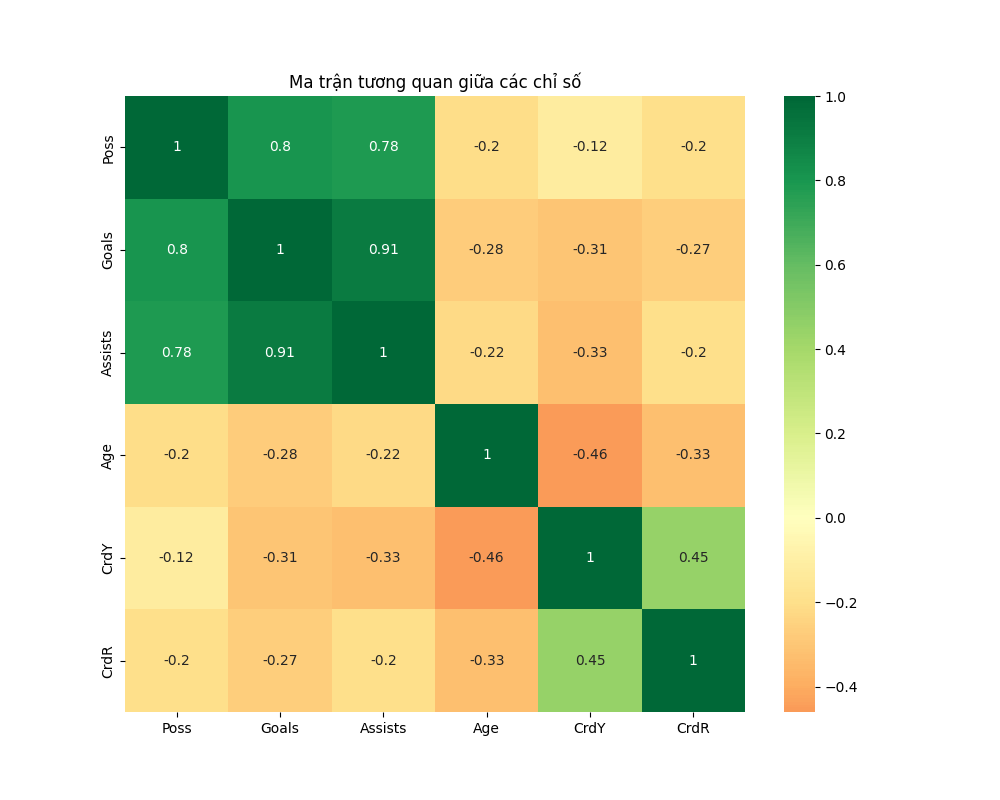
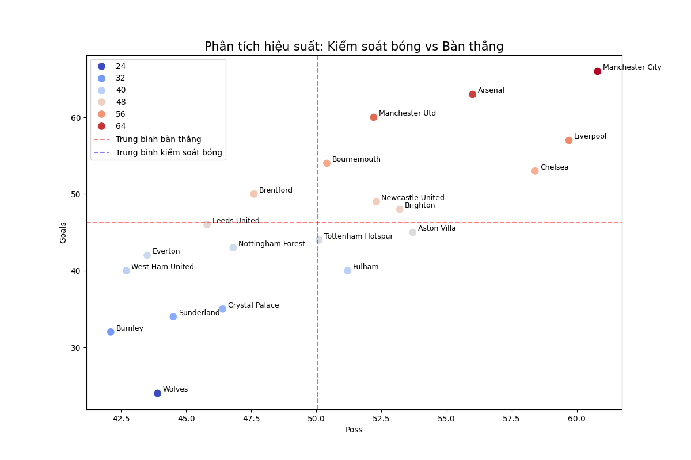
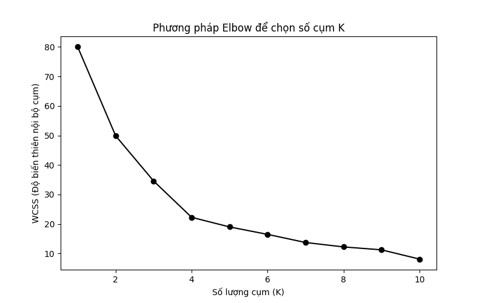
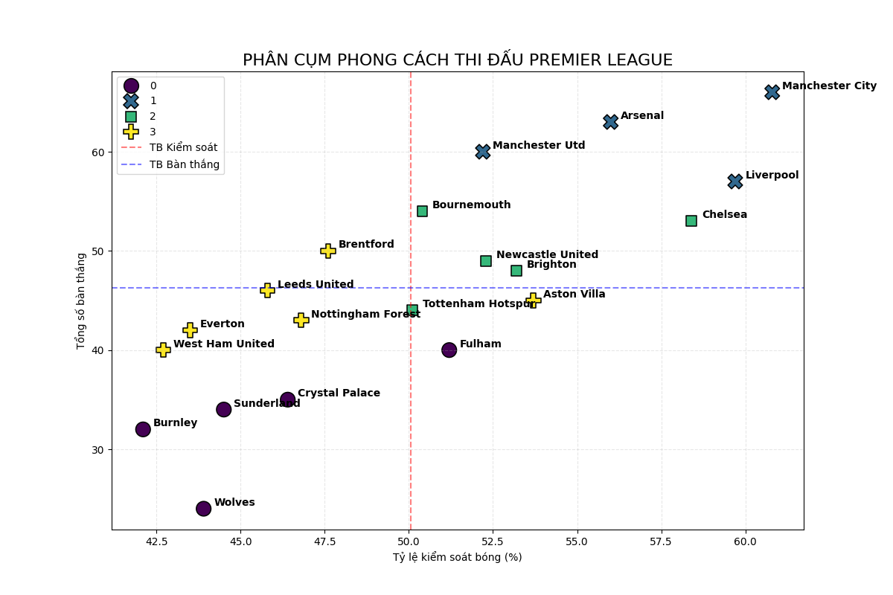

⚽ Premier League Style & Performance Clustering

📌 Tổng quan dự án
Dự án này sử dụng Machine Learning (Phương pháp phân cụm K-Means) để phân loại phong cách thi đấu và hiệu suất của 20 đội bóng tại giải Ngoại hạng Anh (Premier League). Thay vì nhìn bảng xếp hạng, dự án đi sâu vào việc tìm ra các nhóm đội bóng có đặc điểm tương đồng về khả năng kiểm soát bóng, hiệu suất ghi bàn và kỷ luật trên sân. 

🛠 Công cụ sử dụng
* **Ngôn ngữ:** Python
* **Thư viện chính:** 
    * `Pandas`: Xử lý và làm sạch dữ liệu.
    * `Scikit-learn`: Thực hiện chuẩn hóa và phân cụm.
    * `Matplotlib` & `Seaborn`: Trực quan hóa kết quả và ma trận tương quan.
* **Nguồn dữ liệu:** [FBRef](https://fbref.com/)(Dữ liệu thống kê mùa giải 2025-2026).

📊 Quy trình thực hiện
1. **Thu thập dữ liệu và Tiền xử lý (Data Preprocessing):** 
    * Làm sạch dữ liệu từ FBref, xử lý lỗi Multi-Index.
    * Đưa dữ liệu về dạng bảng chuẩn để máy tính có thể đọc được.
2. **Các đặc trưng kỹ thuật:** *Dự án tạo ra các chỉ số mới để phản ánh đúng thực tế chuyên môn:
    * Poss_Efficiency: Hiệu suất chuyển hóa kiểm soát bóng thành bàn thắng.
    * Discipline_Score: Điểm kỷ luật dựa trên trọng số (Thẻ vàng x1, Thẻ đỏ x3).
    * Min_per_NonPK_Goal: Hiệu suất thời gian ghi bàn thực tế (không tính PK).
3. **Phân tích (EDA) và Trực quan hóa:** 
    * Sử dụng Heatmap để tìm mối tương quan giữa các đặc trưng quan trọng (tuổi tác, kiểm soát bóng, bàn thắng,...)
    
    *Hình 1: Mối tương quan giữa các đặc trưng chính của dữ liệu*
    * Scatter Plot để xác định các nhóm đội bóng tiềm năng trước khi đưa vào mô hình.
    
    *Hình 2: Biểu đồ thể hiện hiệu suất Kiểm soát bóng và Bàn thắng*
4. **Mô hình hóa (Modeling):**
    * Thuật toán: K-Means Clustering.
    * Tối ưu hóa số cụm: Sử dụng Phương pháp Elbow để xác định số cụm lý tưởng (K=4).
    
    *Hình 3: Biểu đồ tìm điểm "Khuỷu tay" để tối ưu hóa số cụm*
    * Chuẩn hóa: Dùng StandardScaler để đưa các biến về cùng một thang đo.
## 🧪 Đánh giá mô hình (Evaluation)
* Sau khi thực hiện phân cụm với K=4, mô hình được đánh giá qua các chỉ số kỹ thuật sau để đảm bảo tính tối ưu:
    * Silhouette Score: 0.3240 - Cho thấy các cụm có sự phân hóa ổn định, khẳng định các nhóm có phong cách tách biệt rõ ràng.
    * Davies-Bouldin Index: 0.9131 - Khoảng cách giữa các đội trong cùng một cụm là nhỏ và khoảng cách giữa các tâm cụm là đủ lớn.
    * Calinski-Harabasz Index: 13.8369 - Xác nhận cấu trúc phân cụm hiện tại có hiệu quả về mặt phương sai, giúp phân loại rõ giữa nhóm đội chơi kiểm soát bóng và nhó chơi bóng thực dụng.

## 💡 Kết quả phân tích chính (Key Insights)

*Hình 4: Biểu đồ phân cụm các đội bóng ở Premier League*
* Dựa trên kết quả từ mô hình K-Means, 20 đội bóng được phân loại vào 4 nhóm phong cách riêng biệt:
    * Cụm 1 (Elite Dominance): Kiểm soát bóng áp đảo (>60%), hiệu suất ghi bàn cao nhất giải (Man City, Arsenal, Liverpool, Man Utd)
    * Cụm 2 (Challengers): Có chỉ số kiểm soát bóng khá tốt nhưng thiếu đột biến trong vòng cấm (Chelsea, Tottenham, Newcastle, Brighton, Bournemouth)
    * Cụm 3 (High Intensity): Lối chơi nhiệt huyết, không ngại va chạm, pressing tầm cao và ít cầm bóng (Aston Villa, Brentford, Everton, Leed United, Nottingham Forest, West Ham United)
    * Cụm 0 (Low-Block): Phòng ngự thực dụng, nhường thế trận cho đối thủ và ưu tiên sự an toàn (Burnley, Crystal Palace, Fulham, Sunderland, Wolves)

## 🚀 Cách chạy dự án
Để chạy dự án này trên máy tính của bạn, hãy thực hiện theo các bước sau:
1. **Clone dự án:** git clone https://github.com/ten-cua-ban/ten-repo.git
cd ten-repo
2. **Cài đặt thư viện:** 
Bạn nên sử dụng môi trường ảo (venv) để tránh xung đột thư viện:
    pip install pandas scikit-learn seaborn matplotlib 
3. **Chuẩn bị dữ liệu:**
Đảm bảo file dữ liệu squad_stats_pl.csv đã nằm trong thư mục gốc của dự án. (Nếu bạn chạy từ file HTML, hãy bỏ comment phần DATA COLLECTION trong main.py).
4. **Chạy file:**
    python main.py
5. **Kiểm tra kết quả:**
* Sau khi chạy, các file báo cáo và hình ảnh sau sẽ tự động được tạo ra:
    * correlation_heatmap.png: Ma trận tương quan giữa các đặc trưng.
    * elbow_method.png: Biểu đồ xác định số cụm tối ưu.
    * team_clusters_final.png: Biểu đồ phân cụm các đội bóng.
